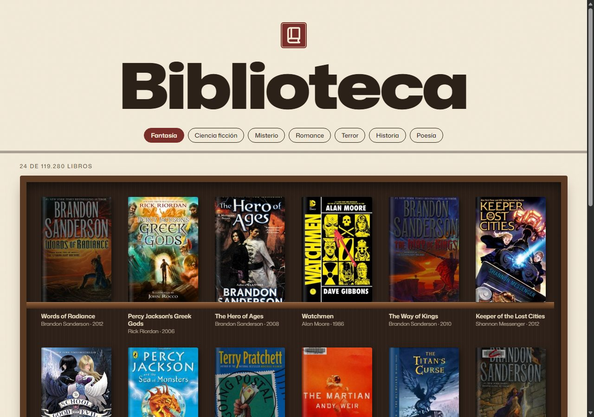
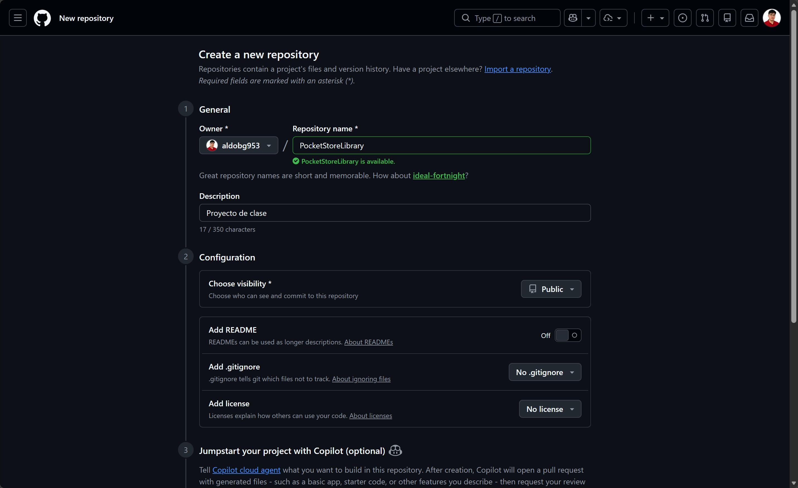
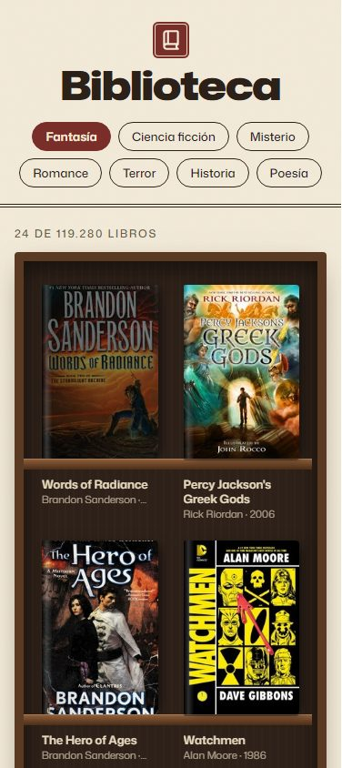

# 📚 PocketStore · Biblioteca

Práctica **PocketStore**: aplicación web progresiva (PWA) de una sola página, titulada **Biblioteca**, que muestra un catálogo de libros en forma de **estantería**, con datos de la [Open Library API](https://openlibrary.org/developers/api). Está hecha con **HTML, CSS y JavaScript puro (Vanilla JS)** y **funciona sin internet** después de la primera visita.



## Características

- **App Shell** que se pinta al instante: encabezado con el título **Biblioteca** grande y centrado, las categorías debajo y una estantería con lugares vacíos (esqueleto).
- **Estilo vintage**: papel, tinta, vino, latón y madera, con la tipografía **Mona Sans** (Google Fonts) en varios pesos (300 a 850) y su eje de ancho (125 %) para el título.
- **Animación suave y rápida**: los libros aparecen escalonados (340 ms) y las portadas entran con un fundido. Si el usuario tiene activado "reducir movimiento", las animaciones se desactivan.
- **Offline**: la primera carga trae los datos de internet. Desde la segunda, todo sale de la caché del Service Worker. Solo se vuelve a usar la red cuando se piden datos nuevos (otro género o "Cargar más libros").
- **Instalable**: tiene manifiesto e iconos de 192 × 192 y 512 × 512.

## Estructura

```
/PocketStoreLibrary
│
├── index.html         # Vista (App Shell)
├── styles.css         # Estilos del App Shell
├── app.js             # Lógica de la aplicación y registro del SW
├── sw.js              # Controlador (Service Worker y Caché)
├── manifest.json      # Configuración de instalación (Manifiesto)
├── icon/              # Iconos de la app (PNG) e iconos SVG de la interfaz
└── images/            # Capturas del proceso de desarrollo
```

## Cómo ejecutarlo

El Service Worker necesita `localhost` o HTTPS, así que no funciona abriendo el archivo con doble clic. Opciones:

```bash
# Con Python
python -m http.server 5500
# Luego abrir http://localhost:5500
```

También funciona con la extensión **Live Server** de VS Code o publicándolo en **GitHub Pages**.

### Cómo probar el modo offline

1. Abre la app una vez con internet.
2. Abre DevTools → **Application** → **Service Workers** y comprueba que `sw.js` está *activated*.
3. En **Network**, cambia a **Offline** y recarga la página: la estantería carga igual.
4. En **Application → Cache Storage** se ven las dos cachés: `pocketstore-shell-v2` y `pocketstore-data-v1`.

---

## Proceso de desarrollo (paso a paso)

### Paso 0 · Crear el repositorio

Se creó el repositorio público `PocketStoreLibrary` en GitHub, vacío (sin README, sin .gitignore y sin licencia), para subir el proyecto desde cero.



### Paso 1 · El Manifiesto (`manifest.json`)

Se escribió a mano el archivo JSON con:

| Propiedad | Valor | Para qué sirve |
|---|---|---|
| `name` / `short_name` | Biblioteca / Biblioteca | Nombre completo y nombre bajo el icono |
| `start_url` | `./index.html` | Página que abre la app instalada |
| `display` | `standalone` | Se abre como app, sin la barra del navegador |
| `background_color` | `#f3ead8` (papel) | Color de la pantalla de carga |
| `theme_color` | `#7a2e2a` (vino) | Color de la barra del sistema |
| `icons` | 192 × 192 y 512 × 512 | Iconos para instalar la app |

Los iconos PNG tienen un diseño propio: tres libros y uno inclinado sobre una repisa, con fondo vino y marco doble. En `index.html` se enlaza el manifiesto con `<link rel="manifest" href="manifest.json">`.

### Paso 2 · El App Shell (`index.html` y `styles.css`)

Se diseñó la estructura estática que siempre está presente. Se dejó minimalista, sin barra de estado ni pie de página, para que la atención quede en los libros:

- **Encabezado** (`<header>`): el título **Biblioteca** en tamaño muy grande y centrado (crece con la pantalla usando `clamp()`) y, debajo, los botones de género.
- **Contenedor principal** (`<main>`): la estantería (`<ul id="shelf">`). Ya trae **8 lugares vacíos** que parpadean suavemente, así el usuario ve la forma de la página antes de que lleguen los datos.

Decisiones para que **cargue muy rápido**:

- Sin frameworks ni librerías: solo un HTML, un CSS y un JS pequeños.
- `<link rel="preconnect">` hacia Google Fonts y Open Library, para abrir esas conexiones antes de necesitarlas.
- Fuente con `display=swap`: el texto se muestra de inmediato y la fuente se aplica al llegar.
- `app.js` con `defer`, para que no bloquee el pintado.
- Portadas en tamaño mediano (`-M.jpg`), con `loading="lazy"`, `decoding="async"` y medidas fijas (`aspect-ratio: 2 / 3`) para que la página no salte al cargar.

La **estantería** es puro CSS: un marco de madera, un fondo oscuro con vetas y una repisa debajo de cada fila. Cada libro dibuja su tramo de repisa con `::after`, y los tramos se unen en una tabla continua.

### Paso 3 · El Service Worker y la Caché (`sw.js`)

Se programó el ciclo de vida completo:

```js
// 1) INSTALL: guarda el App Shell en la caché
self.addEventListener('install', (event) => {
  event.waitUntil(
    caches.open(SHELL_CACHE)
      .then((cache) => cache.addAll(APP_SHELL))
      .then(() => self.skipWaiting())
  );
});

// 2) ACTIVATE: borra cachés de versiones anteriores y toma el control
self.addEventListener('activate', (event) => { /* caches.keys() → delete → clients.claim() */ });

// 3) FETCH: primero la caché, después la red
self.addEventListener('fetch', (event) => {
  event.respondWith(cacheFirst(event.request));
});
```

La estrategia del evento `fetch` es **Cache First**:

1. Si la petición ya está en la caché, se responde desde ahí, sin internet.
2. Si no está, se pide a la red, la respuesta se guarda en `pocketstore-data-v1` y se entrega a la página.
3. Si no hay red ni copia guardada, la navegación responde con `index.html` y la app muestra un aviso.

Así se cumple la regla: **la primera vez los datos llegan de internet y después ya no**, salvo que se pidan datos nuevos.

> Para publicar cambios en el App Shell hay que subir la versión (por ejemplo, `pocketstore-shell-v3`). El evento `activate` borra la caché anterior.

### Paso 4 · El Contenido Dinámico (`app.js`)

1. **Registro del Service Worker.** En la primera visita, la app espera a que el SW controle la página (`controllerchange`) antes de pedir los datos. Así, desde esa primera visita, el JSON y las portadas quedan guardados.
2. **Consumo de la API con `fetch()`.** Se usa el endpoint de búsqueda de Open Library pidiendo solo los campos necesarios, para que la respuesta pese unos 3 KB:

   ```
   https://openlibrary.org/search.json?subject=fantasy
     &fields=key,title,author_name,first_publish_year,cover_i
     &limit=24&page=1&sort=rating
   ```

   Las portadas salen de `https://covers.openlibrary.org/b/id/{cover_i}-M.jpg`.
3. **Pintado.** Cada libro se convierte en un `<li>` con su portada, título, autor y año, y se inserta todo de una vez con `insertAdjacentHTML`. Si un libro no tiene portada, se dibuja una "encuadernación de tela" con su título.
4. **Interacción.**
   - Botones de **género** (Fantasía, Ciencia ficción, Misterio, Romance, Terror, Historia, Poesía).
   - Botón **Cargar más libros** (paginación).

### Paso 5 · Documentación

Este README describe el proyecto y el proceso. Las imágenes están en [`images/`](images/).

---

## Resultado

| Escritorio | Móvil |
|---|---|
|  |  |

## Créditos

- Datos y portadas: [Open Library](https://openlibrary.org) (Internet Archive).
- Tipografía: [Mona Sans](https://fonts.google.com/specimen/Mona+Sans) de GitHub, vía Google Fonts.
- Iconos de la interfaz: [Material Symbols](https://fonts.google.com/icons).
